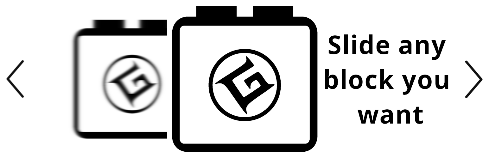

[Leer en español](./LEEME.md)

```
Contributors : gigenam
Plugin URI   : https://wordpress.org/plugins/mg-block-slider
License      : GPLv2 or later
License URI  : https://www.gnu.org/licenses/old-licenses/gpl-2.0.html
```




# MG Block Slider

A simple slideshow block to use it in any block editor with any type of content.
Post, pages, widgets. Anything and anywhere you want.

## Description

Make a slideshow of almost any other default block. Images, videos, groups,
columns, etc. With a simple block interface and a couple of configurations you
can customize and add as many slideshows in your content as you want.

In the first step when you add a new slide, you will see only a couple of blocks
to select. This is for simplicity and to highlight the most common ones (and most
tested), but you can add anything inside. For example, you want to slide posts,
widgets, files, even WooCommerce products? Add a group block, or a cover, or
columns and put any block inside.

A couple of examples of what you can configure with this plugin.

- Multiple navigations (arrows, dots, thumbnails).
- Auto start changing slides and stop on hover.
- Change slides with touch gestures or arrow keys.
- Multiple animations.
- Multiple transitions and the possibility to add custom CSS transitions.
- Custom time between slides and changing speed.
- Custom interactions for videos.
- Light and Dark theme.
- A couple of arrows and dots types to choose.
- Texts in English and Spanish (check FAQ), and is translation ready.
- Developer friendly, you can add your own assets with a couple of CSS lines.

Go to the [Wiki](https://github.com/gigenam/mgblockslider/wiki) for the full
documentation on how to use and/or customize everything.

## Installation

Install it like any other plugin, via the WordPress plugin directory inside your
WordPress administration or by downloading this repo, compile it and upload the
content of the `app` folder to your server at /wp-content/plugins/.

Go to the [Wiki](https://github.com/gigenam/mgblockslider/wiki) for the full
documentation on how to use and/or customize everything.

## Development

Install all the dependencies with `npm start` or `npm start:no-composer`.

There are separate task for php and js and for blocks development.

- Run `npm run dev` for modify the core slider js, styles and images files.
- Run `npm run blocks` for modify the blocks for the editor.

Ready for production?

- Run `npm run build` and `npm run build-blocks`.

For more info, check the [package.json](package.json) and [gulpfile.js](gulpfile.js).

## Frequently Asked Questions

Check the [readme.txt](./app/readme.txt#L40).

## Changelog

See [CHANGELOG.md](./CHANGELOG.md) for all the updates of this repository.

See [Changelog.txt](./app/changelog.txt) for all the updates of the plugin.
